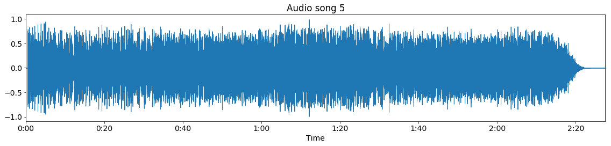
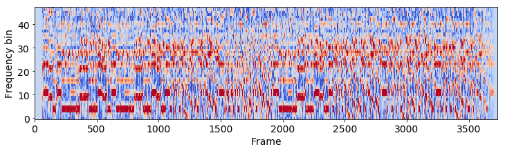
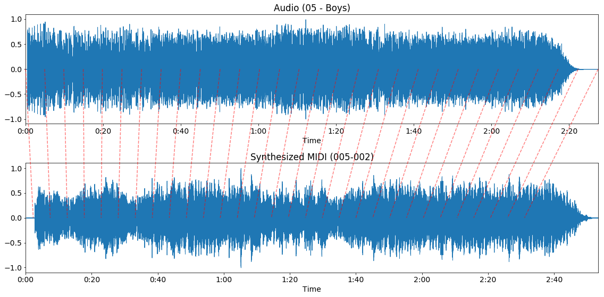

======================
Aligning MIDI to audio
======================

In order to receive audio-timed chord labels from a MIDI file, DECIBEL first finds an optimal alignment from the Midi
file to the audio file, realigns the MIDI file using this alignment and then uses a MIDI chord recognizer to estimate
the chord labels on the realigned MIDI file. The audio-midi aligner contains methods to re-align the MIDI file to the
audio file.

For alignment between MIDI files and audio recordings, DECIBEL uses a DTW algorithm by Raffel and Ellis
([raffel2016optimizing]_) Dynamic Time Warping (DTW) is a common technique to align two feature vectors, for example
two representations of the same song.

Let us have a look at the outline of the algorithm. First, all MIDI files are synthesized using the fluidsynth software
synthesizer with the FluidR3_GM soundfont. Now we have a waveform representation for both the audio and the MIDI file,
as shown below:

**Audio waveform**

**Synthesized MIDI waveform**

.. image:: Synth-MIDI-waveform.png

Note that our example MIDI file starts with silence, while in the audio recording the music starts immediately. Also,
the MIDI file has a longer duration, as the MIDI file repeats the chorus an additional time, compared to the audio
file. Then, the Constant-Q transform is calculated for both the audio and the synthesized MIDI waveform:

**Audio CQT**

.. image:: Audio-cqt.png

**Synthesized MIDI CQT**

Features are found by aggregation over the Constant-Q transform vectors. Then, the optimal path between the audio file
and the synthesized MIDI is calculated using DTW. This results in an optimal path and the alignment confidence score:

**Alignment path**

.. image:: Alignment.png

In this figure, we see that the alignment path starts not in the coordinate (0, 0), but a bit to the right: the silence
at the start of the MIDI file is not mapped to any position in the audio file. The same goes for the end of the MIDI
file, which is a superfluous repetition of the chorus. Finally, this alignment path is used to remap the MIDI file to
the audio recording:

**MIDI re-alignment**

Decibel uses the unchanged parameter setting reported in the paper by [raffel2016optimizing]_:

======================= ========================================
Parameter               Setting
======================= ========================================
Feature representation  log-magnitude Constant-Q transform
Time scale              every 46 milliseconds
Cost function           cosine distance
Penalty                 median distance of all pairs of frames
Gully                   0.96
Band path constraint    none
======================= ========================================

Synthesize MIDI files
---------------------

.. automodule:: decibel.audio_midi_aligner.synthesizer
    :members:
    :undoc-members:
    :show-inheritance:

Aligning synthesized MIDI to audio
----------------------------------

.. automodule:: decibel.audio_midi_aligner.aligner
    :members:
    :undoc-members:
    :show-inheritance:

.. [raffel2016optimizing] Raffel, Colin, and Daniel PW Ellis. "Optimizing DTW-based audio-to-MIDI alignment and
   matching." 2016 IEEE International Conference on Acoustics, Speech and Signal Processing (ICASSP), IEEE, 2016.
