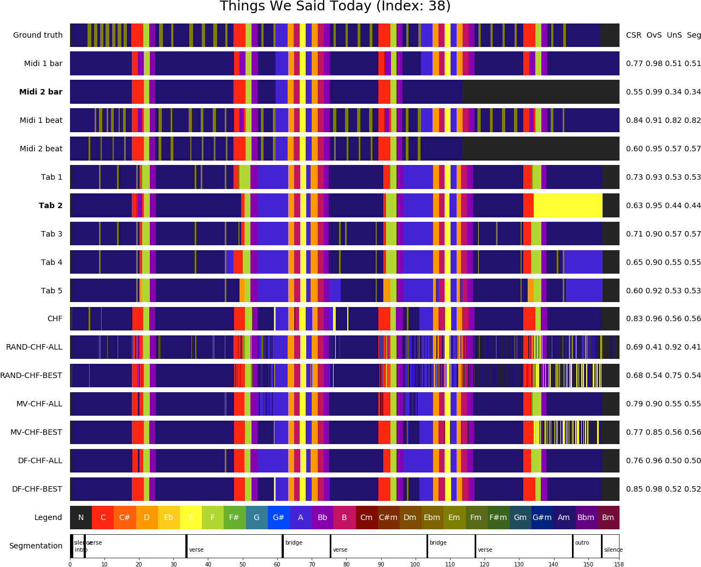

===========
Data Fusion
===========

DECIBEL estimates chord label sequences from different music representations, i.e. audio, MIDI and tab files.
This results in a set of chord label sequences for each song in our data set.
This set of chord labels forms a rich harmonic representation that is already interesting in itself.
However, in order to answer our research question we need to combine these chord label sequences into one final
sequence (and compare the resulting chord sequence to the sequence obtained by using only an audio ACE method).
DECIBEL achieves this using a data fusion step.

DECIBEL compares two selection strategies in combination with three different integration methods. The two selection
strategies are ALL and BEST: ALL takes the chord sequences of all tabs and MIDI files as sources. BEST only uses the
sources of the expected best tab and MIDI file for each song. This way, the integration method is always applied to only
three sources.

The three integration methods are based on the earlier work by \citet{koops2016integration}. Following their work, we
first sample each input chord sequence in 10 millisecond steps. Then we integrate the sources (selected using one of the
two selection strategies) with either random picking (RND), majority voting (MV) or data fusion (DF). The
implementations of RND and MV are unchanged compared to earlier work. For the DF integration method, I made two
alterations: (1) I omitted the source dependency weight, because our MIDI and tab subsystems only use the major-minor
chord vocabulary. Therefore, there is no matter of rare chords as in earlier work by \citet{koops2016integration}.
(2) I empirically tested the number of iterations needed for reaching a fixed point, and henceforth always terminate
the DF algorithm after this number of iterations, without checking if a fixed point was reached.

In our experiments on the Isophonics data set, we have seen that DF-BEST is the best combination of the selection
strategy and integration method. DF-BEST performs significantly better than the original audio algorithm in terms of
WCSR and does not suffer from oversegmentation as much as the other methods.

.. automodule:: decibel.data_fusion.data_fusion
.. automethod:: decibel.data_fusion.data_fusion.data_fuse_song
