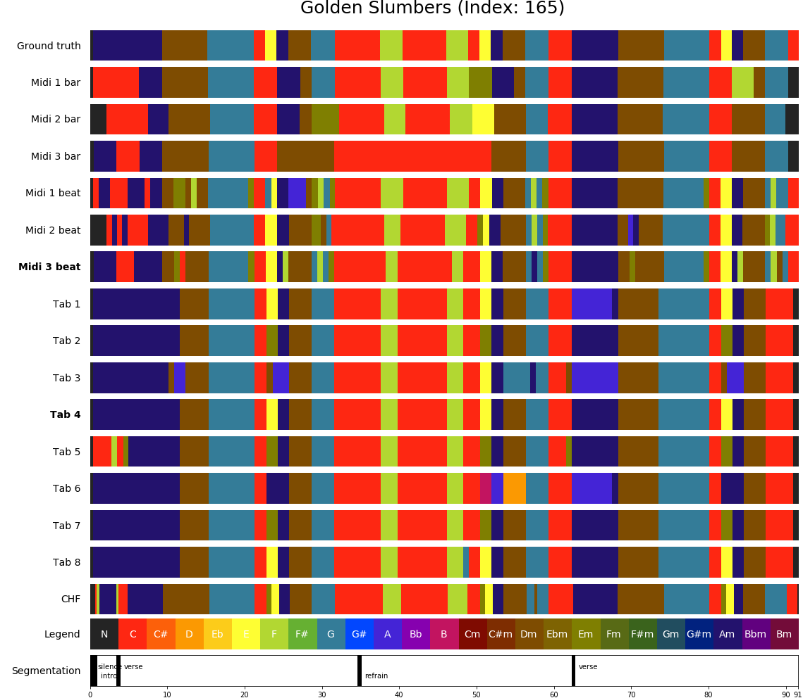

=============
Visualisation
=============

We have seen how DECIBEL's subsystems estimate chord label sequences from audio, MIDI and tab representations of a song.
Audio files are obtained by digitizing the waveform; MIDI files are a series of note on and note off events; whereas tab
files show the guitar fingering or chord labels, aligned to the lyrics. The timing information in audio is represented
in seconds, based on the underlying performance; in MIDI files, timing is measured in ticks; in tabs, timing information
is missing. Also, the source of information differs: audio files are recordings of a performance; MIDI files are either
score-based or transcriptions of a recording; tabs can be considered as (untimed) chord label sequences, manually
annotated by music enthusiasts.

However, the chord label estimation and synchronization steps performed by DECIBEL's subsystems transform these three
heterogeneous representations into a homogeneous format, i.e. as a series of <start time, end time, chord label>
3-tuples. The combination of the set of chord label sequences from each of the representations of a song results in a
**rich harmonic representation**.

This rich harmonic representation is a very interesting by-product of the DECIBEL system, as it allows for
cross-version analysis, i.e. comparing analysis results from different representations. The chord label sequences can
easily be visualized, which makes it very easy to see the consistencies and inconsistencies in chord labels between
different representations. Having such a unified view of different analysis results deepens the understanding of both
the algorithm's behavior and the properties of the underlying musical material.

Consider for example the visualization of the chord label sequence for the Beatles song *Golden Slumbers* below.
In our data set, we have matched three MIDI files and eight tab files to the audio version of the song. CASSETTE, our
MIDI ACE method, analyzes the chords both on a bar and a beat level, so we have six chord label sequences based on the
three MIDI files. In combination with the eight chord label sequences based on the tab files and a single analysis by
the Chordify algorithm based on the audio file, we have 6 + 8 + 1 = 15 chord label sequences. Each of these estimated
chord sequences, as well as the ground truth, is visually represented by a horizontal bar in which the color represent
the chord label and time in seconds can be read from the position on the x-axis. In this example, we observe there are
some parts of the song for which (most of) the 15 estimated chord sequences agree on the labels, e.g. the D minor chord
starting after 11 seconds; the G major chord sounding immediately thereafter or the C major chord that starts at 32
seconds. However, in other musical passages there is some disagreement. If there is a single deviating chord sequence
estimation, this is typically either due to some error in the MIDI or tab file or due to an error in the estimation
method. For example, when estimating the chord sounding in the 38th second from our third MIDI file, using CASSETTE on
the bar level, we falsely find a F major chord instead of a C major chord. In some passages, we observe multiple
"clusters" of possible chord labels, i.e. different perspectives on the harmonic content of a musical passage, each of
them supported by multiple chord label estimations. For example, we can consider the start of the song either as a
long A minor chord or as a sequence of A minor and C major chords. Also, there exist different perspectives on the chord
in the 23rd second (is it a C major, E major, F minor or something else?) and the modality of the A (major or minor)
chord starting after 62 seconds.

MIDI and tab files implicitly incorporate musical knowledge, as they are (in the popular music genre) typically
transcriptions made by music enthusiasts. Therefore, the comparison of analysis results from different music
representations reveals passages in the music for which there are multiple possible perspectives. Studying these
passages can give us a deeper understanding of subjectivity issues in the musical material.

.. automodule:: decibel.evaluator.chord_label_visualiser
    :members:
    :undoc-members:
    :show-inheritance: